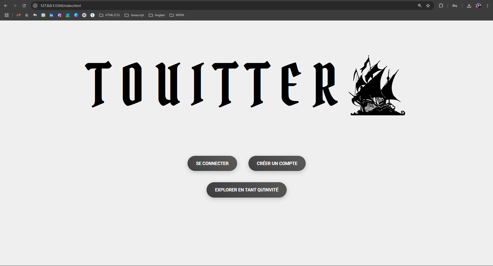
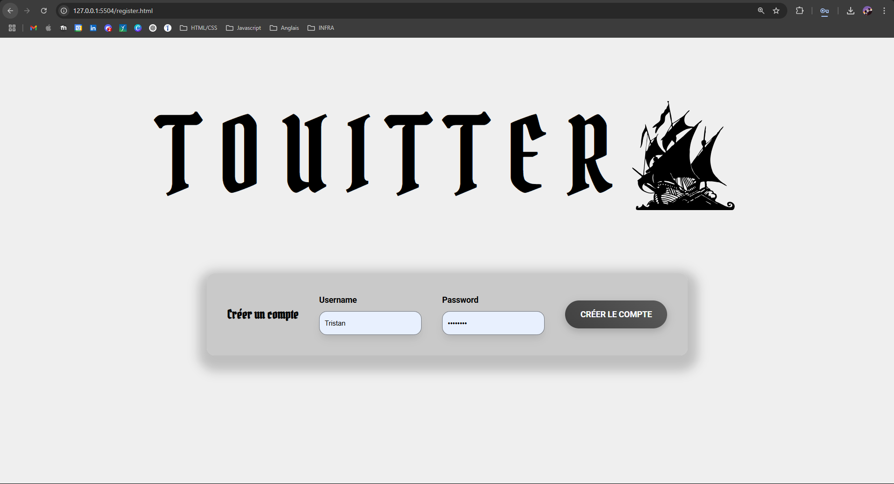
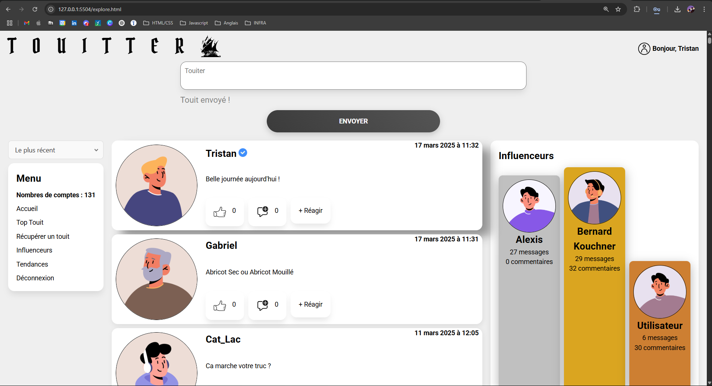
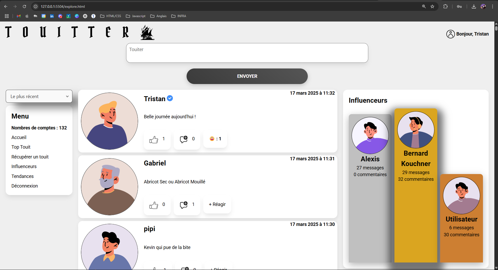
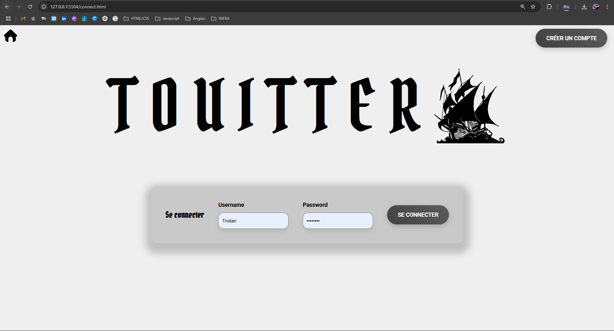
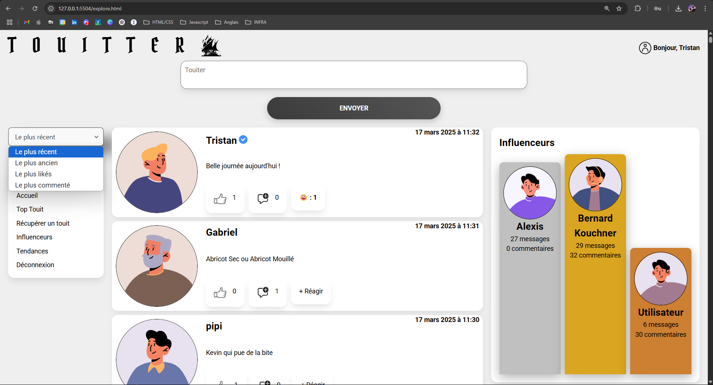

### Français

Mon projet est une application web nommée "Touiteur", c'est une sorte de réseau social où les utilisateurs peuvent publier des messages courts appelés "touits". Voici un aperçu des principaux composants de ce projet :

#### HTML :

- `index.html` : Page d'accueil avec des options pour se connecter, créer un compte ou explorer en tant qu'invité.
- `connect.html` : Page de connexion pour les utilisateurs existants.
- `register.html` : Page d'inscription pour les nouveaux utilisateurs.
- `explore.html` : Page principale où les utilisateurs peuvent voir et interagir avec les touits.

#### CSS :

- `reset.css` : Réinitialise les styles par défaut du navigateur.
- `helpers.css` : Contient des styles utilitaires pour améliorer l'expérience utilisateur.
- `style.css` : Contient les styles principaux de l'application.

#### JavaScript :

- `config.js` : Contient les URL des API utilisées dans l'application.
- `connect.js` : Gère la connexion des utilisateurs.
- `register.js` : Gère l'inscription des utilisateurs.
- `script.js` : Gère l'affichage et l'interaction avec les touits.
- `func.js` : Contient des fonctions utilitaires pour des tâches comme la déconnexion, le formatage des dates, et la gestion des likes et des commentaires.

#### Autres fichiers :

- `.gitignore` : Spécifie les fichiers à ignorer par Git.
- `manifest.webmanifest` : Fichier de configuration pour les icônes de l'application.

### English

My project is a web application named "Touiteur", which appears to be a social network where users can post short messages called "touits". Here is an overview of the main components of this project:

#### HTML:

- `index.html`: Home page with options to log in, create an account, or explore as a guest.
- `connect.html`: Login page for existing users.
- `register.html`: Registration page for new users.
- `explore.html`: Main page where users can view and interact with touits.

#### CSS:

- `reset.css`: Resets the browser's default styles.
- `helpers.css`: Contains utility styles to enhance the user experience.
- `style.css`: Contains the main styles of the application.

#### JavaScript:

- `config.js`: Contains the API URLs used in the application.
- `connect.js`: Manages user login.
- `register.js`: Manages user registration.
- `script.js`: Manages the display and interaction with touits.
- `func.js`: Contains utility functions for tasks like logging out, formatting dates, and managing likes and comments.

#### Other files:

- `.gitignore`: Specifies files to be ignored by Git.
- `manifest.webmanifest`: Configuration file for the application's icons.

## Images 

#### Illustrations:

